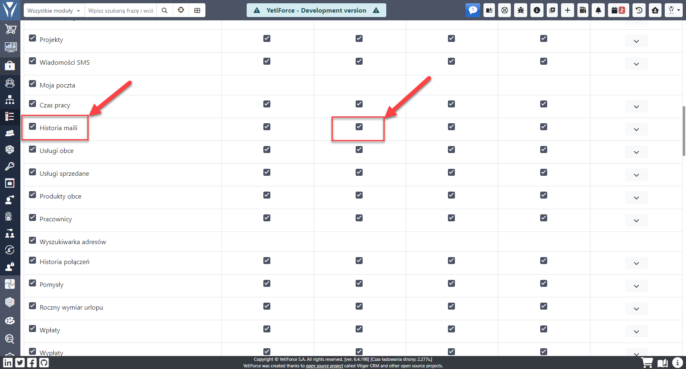
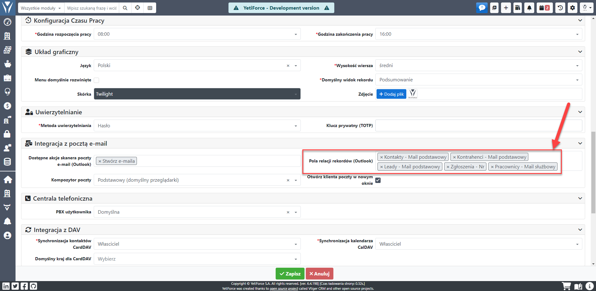
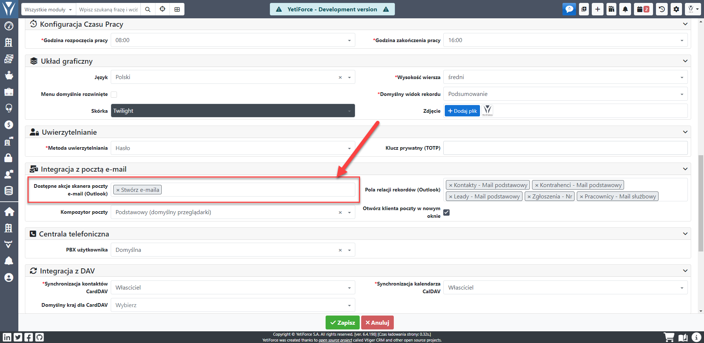
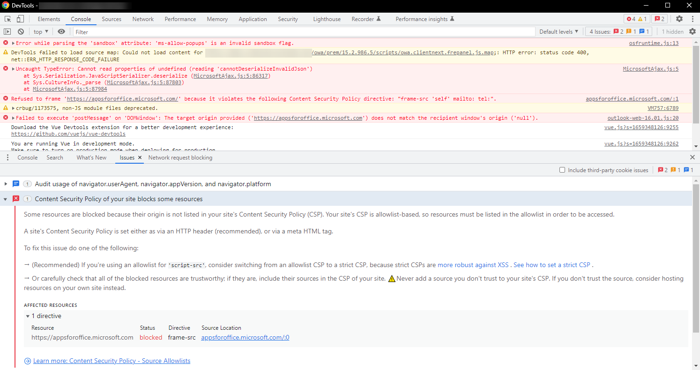

import Tabs from '@theme/Tabs';
import TabItem from '@theme/TabItem';
import ReactPlayer from 'react-player';

## Panel description

The add-in was built in accordance with the Office Outlook Add-in ([Documentation](https://docs.microsoft.com/en-us/office/dev/add-ins/outlook/)), which allows you to show a YetiForce panel in the form of a window in all Outlook applications.

Thanks to this solution, it's not necessary to make a copy of the entire YetiForce system in Outlook - instead, the app is shown and integrated with certain Outlook functions.

The implementation of the add-in allows you to use of all YetiForce functionalities in Outlook.

:::important
The article presents the most important issues related to the Outlook add-in for YetiForce CRM, so it is important to read it carefully and follow the guidelines for the add-in to work properly.
:::

## Video presentation

<Tabs groupId="WwgE1yX6akE">
	<TabItem value="youtube-WwgE1yX6akE" label="🎬 YouTube">
		<ReactPlayer
			url="https://www.youtube.com/watch?v=WwgE1yX6akE"
			width="100%"
			height="500px"
			controls={true}
		/>
	</TabItem>
	<TabItem value="yetiforce-WwgE1yX6akE" label="🎥 YetiForce TV">
		<ReactPlayer url="/video/outlook-integration-panel.mp4" width="100%" height="500px" controls={true} />
	</TabItem>
</Tabs>

## Requirements

### SSL/HTTPS

The add-in requires the system to work with a valid SSL certificate. `Self signed certificates are not accepted`

### Compatibility

The add-in supports the following Outlook application types::

- Outlook 2013 or later on Windows
- Outlook 2016 or later on Mac
- Outlook on iOS
- Outlook on Android
- Outlook on the web for Exchange 2016 or later
- Outlook on the web for Exchange 2013
- Outlook.com

:::warning
The client must be connected to an Exchange server or Microsoft 365 (formerly known as Office 365) using a direct connection. When configuring the client, the user must choose an Exchange, Office, or Outlook.com account type. Add-ons will not load if your mail client is configured to connect via POP3 or IMAP.

More information: [Outlook add-in requirements](https://learn.microsoft.com/en-us/office/dev/add-ins/outlook/add-in-requirements)
:::

### Browser engine

Please check your Outlook version as the add-on is based on the web browser engine.
The YetiForce system will not work fully properly for old versions that support the "Internet Explorer" engine.

For a full description of the requirements, see [Browsers used by Office add-ins](https://learn.microsoft.com/en-us/office/dev/add-ins/concepts/browsers-used-by-office-web-add-ins)

## Install / enable the integration

After the purchase, you need to activate the add-in. When the `Requires intervention` button appears in the Marketplace, go to the `Integration` tab, click `Activate`, enter the required data, and download the installation file.


### Video tutorial

<ReactPlayer
	url="https://www.youtube.com/watch?v=HTRG81waq54"
	width="100%"
	height="500px"
	controls={true}
/>

### Activation

During activation, the system will be configured for integration with Outlook. The following parameters will be changed:W

- allows loading the app in iframe
- allows loading external web scripts (https://appsforoffice.microsoft.com, https://ajax.aspnetcdn.com)
- disables HttpOnly in cookie (in order not to log in every time the integration panel is launched)
- changes the "SameSite" cookie to "None"


### Download the add-in

In order to install the add-in you must first download the XML file and import it in Outlook.

Go to `system settings > Integration > Mail integration panel` and click `Download the Outlook add-in installation file`. The XML you downloaded is exclusive for an individual version of YetiForce and includes the APP ID. If [APP ID](/administrator-guides/app-id) changes, you will have to reinstall the plugin. This has been done so that you cannot load the system in any other window.

### Installation of the add-in extension in Outlook

Installation instructions are available at the [official Microsoft website](https://support.microsoft.com/en-us/office/installed-add-ins-a61762b7-7a82-47bd-b14e-bbc15eaeb70f).
Please follow the instructions from the link above for proper installation.

### Permission to access cookies (only the web version of Outlook web app)

You must permit cookies from other websites on the Outlook Web App page.
By default, the browser blocks unwanted scripts from additional websites.


If you don't change it, it won't be possible to log into the YetiForce system and the user will only see the login page despite entering access data.


## Permissions

Users need access to the `Mail integration panel` in order to use the integration panel.

## Panel access

Permissions for this panel can be configured in [System settings > Permissions > Profiles](/administrator-guides/permissions/profiles/). Grant the applicable module permissions for appropriate profiles.

If the user doesn't have access to the module, the following message will appear: `Error!!! Permission denied`.


## Access to email import

In order for the email import button to appear, the user must have the `create` option ticked for the `Email history` module.



## Data binding

In order to be able to bind data from an e-mail message to system data, it is necessary to define how the system can find the data.

Each user that will use the integration panel should have fields from the available modules set in the `Record relation fields (Outlook)`, in which the system will search for data to bind.

Enter fields here depending on which modules/fields you use and which modules/fields a given user can use.

In the `Available mail scanner actions` field select `Create email` and ` Create email links`.

The fields will be used to search for related records when displaying an email and when importing an email.

Otherwise, you will not see any data in the integration panel, because the system will not know where to search for information.

Standard fields are: Contacts - Primary email, Accounts - Primary email, Leads - Primary email, Tickets - No., Employees - Business email.



## Actions

For the `Import email manually` to appear,it is required to configure actions.
Actions are configured in the Users module in the `Available e-mail scanner actions (Outlook)` field.

Standard actions:

- Create email message - action that creates an e-mail
- Create links to e-mail message - action binding the e-mail message with records in the system, select fields to bind in the "Record relation fields". If no value is selected in this field, the binding will not work.



## Possible issues


Debugging should take place each time there are issues related to the integration panel.

Below you can find a list of the possible issues we encountered.

## CSP Policy

`Refused to frame 'https://appsforoffice.microsoft.com/' because it violates the following Content Security Policy directive: "frame-src 'self' mailto: tel:".`



In the [config/Security.php](https://doc.yetiforce.com/code/classes/Config-Security.html) file in the [$allowedDomainsLoadInFrame](https://doc.yetiforce.com/code/classes/Config-Security.html#property_allowedDomainsLoadInFrame) variable set the following value:

https://github.com/YetiForceCompany/YetiForceCRM/blob/developer/config/Security.php#L181-L185

```php
/**
 * Allowed domains for loading script, used in CSP.
 */
public static $allowedScriptDomains = ['https://appsforoffice.microsoft.com', 'https://ajax.aspnetcdn.com'];
/**
 * Specifies valid sources for nested browsing contexts loading using elements such as <frame> and <iframe>.
 * CSP: frame-src.
 */
public static $allowedDomainsLoadInFrame = ['https://appsforoffice.microsoft.com'];
```

## Debugging

When the panel is not displayed correctly or data is missing: https://docs.microsoft.com/en-US/outlook/troubleshoot/user-interface/office-add-ins-not-displayed-correctly

Debugging: https://docs.microsoft.com/en-us/office/dev/add-ins/testing/test-debug-office-add-ins

Debugging using Microsoft Edge DevTools: https://docs.microsoft.com/en-us/office/dev/add-ins/testing/debug-add-ins-using-f12-developer-tools-on-windows-10#debug-using-microsoft-edge-devtools
