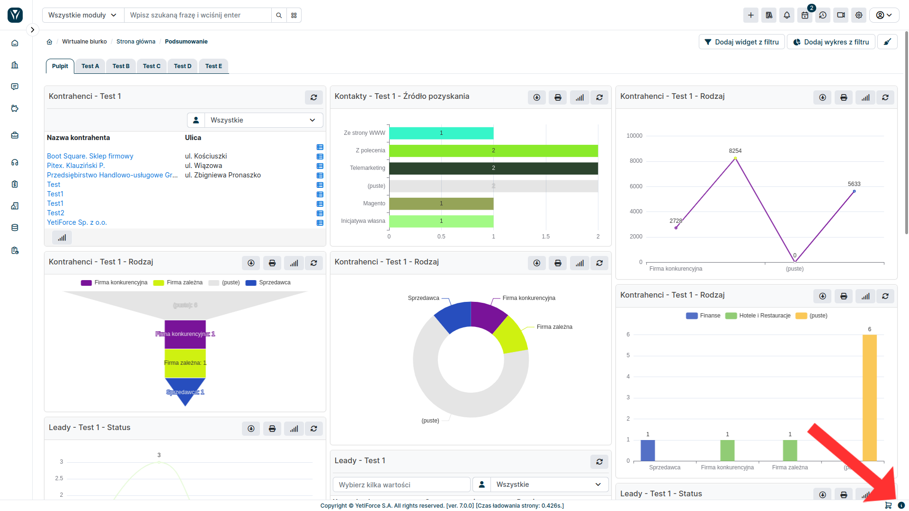
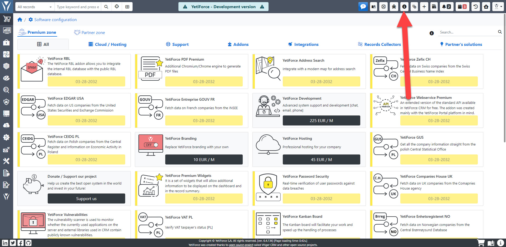
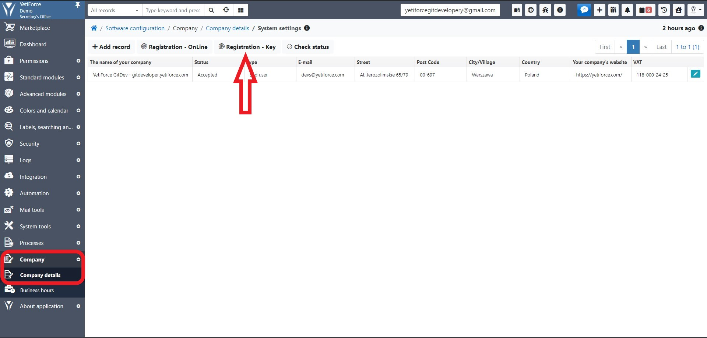

## Dlaczego powstał APP ID?

### Rejestracja

Mechanizm rejestracji wymagał powiązania danych rejestracyjnych z konkretną instancją systemu YetiForce, co wymagało stworzenia unikalnego identyfikatora danej instancji. W przeciwnym razie identyfikacja systemu byłaby niemożliwa.

### Marketplace

Przy zakupie niektórych produktów w naszym Marketplace konieczne będzie przesłanie do nas informacji o APP ID, który identyfikuje system do którego zakupiony został dany dodatek. Jako producent systemu nie zbieramy żadnych identyfikujących informacji o systemie, dlatego przy zakupie usług, które musimy dla Państwa aktywować, konieczna jest weryfikacja APP ID.

## Z czego składa się YetiForce APP ID?

APP ID to suma kontrolna, w której skład wchodzą następujące składowe:

- **ID systemu**, który jest losowo generowany podczas instalacji i nie ulega zmianie ([$application_unique_key z pliku config/Main.php](https://doc.yetiforce.com/code/classes/Config-Main.html#property_application_unique_key))
- **System URL** where the system is located ([$site_URL z pliku config/Main.php](https://doc.yetiforce.com/code/classes/Config-Main.html#property_site_URL))
- **Server Host Name** where the system is located

:::warning

Wykupione dodatki przestaną działać jeśli APP ID naszego systemu ulegnie zmianie. Przeczytaj FAQ na dole strony z Dodatkami by dowiedzieć się jak je ponownie aktywować.

:::

## Dlaczego APP ID ulega zmianie?

Identyfikator musi zawierać elementy unikalne dla każdego serwera, aby ID był unikalny i nie powielał się, dlatego posiada kilka składowych. Jeśli któryś z opisanych wyżej części APP ID ulegnie zmianie, system będzie wymagał ponownej rejestracji.

Często APP ID zmienia się w środowisku Docker, gdy nie zostało ono odpowiednio zabezpieczone przed zmianami APP ID. W przypadku migracji systemu YetiForce CRM na inny serwer APP ID również ulegnie zmianie.

Poniżej przedstawiamy krótką instrukcję pokazującą gdzie znaleźć APP ID.

## Gdzie znaleźć APP ID

### Dla wersji 6.0 i nowszych

#### Krok 1A Domyślny branding YetiForce

Ten krok ma zastosowanie w systemach używających domyślnego brandingu YetiForce. Jeśli w Twoim systemie została wykupiona usługa [Disable YetiForce Branding](https://yetiforce.com/pl/yetiforce-branding) przejdź do kroku 1B.

Jeżeli używasz domyślnego brandingu kliknij ikonę <i className="fas fa-info-circle fa-fw"></i> w prawym dolnym rogu.

#### Krok 1B Niestandardowy branding

Jeśli kupiłeś funkcję [Disable YetiForce Branding](https://yetiforce.com/pl/yetiforce-branding) kliknij ikonę koła zębatego <i className="fas fa-cog fa-fw"></i> w prawym górnym rogu, aby przejść do ustawień, a następnie kliknij ikonę <i className="fas fa-info-circle fa-fw"></i> na górze ekranu.

#### Krok 2 Okno modalne z danymi

APP ID pokaże się w oknie modalnym. Skopiuj identyfikator APP i wyślij go na hello@yetiforce.com

Pamiętaj, aby dołączyć informacje o transakcji PayPal i adres e-mail, który użyłeś do transakcji.

### Dla wersji 5.3 i starszych

#### Krok 1

Przejdź do konfiguracji systemu, klikając przycisk koła zębatego <i className="fas fa-cog fa-fw"></i> w prawym górnym rogu.

#### Krok 2

W panelu menu po lewej stronie wybierz [Firma](/administrator-guides/company) a następnie [Dane firmy](/administrator-guides/company/company-details/). Następnie kliknij `Rejestracja - Klucz` w górnej części ekranu.

#### Krok 3

APP ID pokaże się w oknie modalnym. Skopiuj identyfikator APP i wyślij go na hello@yetiforce.com

Pamiętaj, aby dołączyć informacje o transakcji PayPal i adres e-mail, który użyłeś do transakcji.

