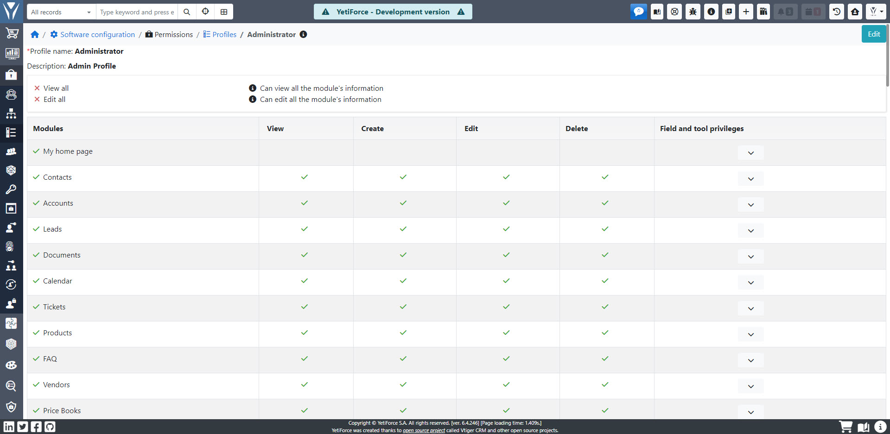
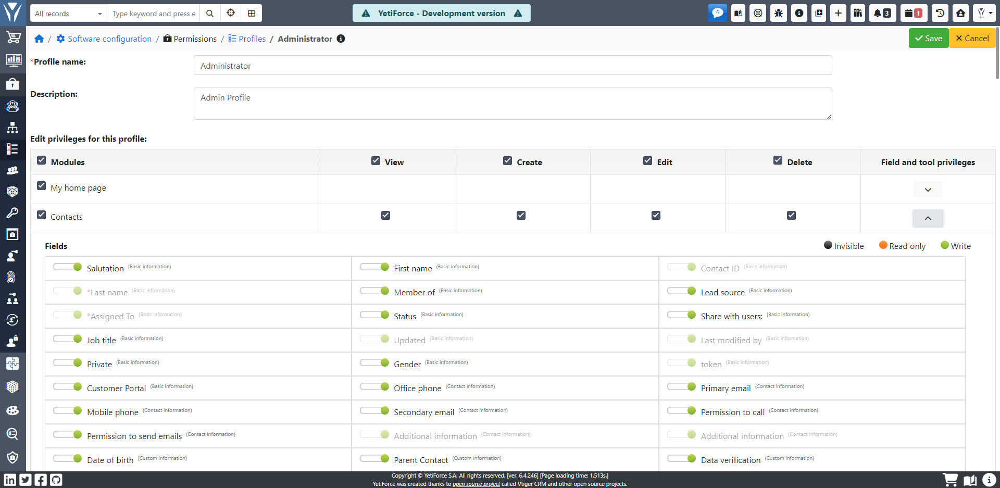

Profile służą do definiowania uprawnień do podstawowych widoków tworzenia, przeglądania, edycji i usuwania rekordów oraz dostępnych w nich narzędziach.

## Dodawanie nowego profilu

W systemie domyślnie istnieje jeden profil - Administrator. By dodać nowy profil ze wstępnie skonfigurowanymi uprawnieniami należy kliknąć przycisk <kbd>+ Dodaj profil</kbd> w lewym górnym rogu ekranu. Gdy zostaniemy przeniesieni na stronę tworzenia nowego profilu musimy wybrać dla niego nazwę oraz opcjonalnie uzupełnić jego opis. Następnie w tabeli `Edytuj uprawnienia do profilu` zaznaczamy odpowiednie uprawnienia do akcji w poszczególnych modułach, które chcemy by nowo utworzony przez nas profil posiadał.

Oprócz ogólnych uprawnień do tworzenia przeglądania, edycji i usuwania rekordów w danych modułach, możemy też skonfigurować uprawnienia do pól i narzędzi. W celu modyfikacji tych uprawnień musimy kliknąć przycisk ze strzałką w dół znajdujący się w kolumnie `uprawnienia do pól i narzędzi` i odpowiednio skonfigurować dodatkowe opcje, które pojawią się na ekranie.

Moduł wspiera masowe zaznaczanie i odznaczanie uprawnień - jeśli klikniemy checkbox na górze kolumny `Moduły` to odznaczymy/zaznaczymy wszystkie opcje dla wszystkich modułów. Jeśli klikniemy na checkbox przy którejkolwiek nazwie akcji to odznaczymy/zaznaczymy uprawnienia do tej akcji dla wszystkich modułów.

Po dostosowaniu uprawnień klikamy przycisk <kbd>Zapisz</kbd>.

## Edycja profilu

W celu modyfikacji uprawnień przypisanych istniejącemu profilowi musimy kliknąć na ikonkę edycji <kbd>✎</kbd>, widoczną w ostatniej kolumnie tabeli profili. System przeniesie nas do obecnych ustawień wybranego profilu, które możemy dowolnie zmodyfikować w sposób opisany powyżej. Po dostosowaniu uprawnień klikamy przycisk <kbd>Zapisz</kbd>.

## Duplikacja profilu

Duplikacja profilu pozwoli na stworzenie profili o podobnych uprawnieniach, bez potrzeby tworzenia go od początku. By zdublować profil musimy kliknąć na ikonkę duplikacji <kbd>⧉</kbd> widoczną w ostatniej kolumnie tabeli profili. System skopiuje uprawnienia wybranego profilu, które możemy dowolnie zmodyfikować w sposób opisany w `Dodawaniu nowego profilu`. Po dostosowaniu uprawnień klikamy przycisk <kbd>Zapisz</kbd>.

## Usuwanie profilu

By usunąć wybrany profil kliknąć na ikonkę kosza widoczną w ostatniej kolumnie tabeli profili. System wyświetli okienko pop up, w którym możemy sprecyzować do którego z pozostałych profili będą przeniesione role, które są przypisane do usuwanego profilu. Następnie klikamy przycisk <kbd>Zapisz</kbd>, wtedy profil zostanie usunięty a role przeniesione.

## Oznaczenia

-  oznacza, że uprawnienie jest aktywne
-  - oznacza, że uprawnienie jest nieaktywne
-  - oznacza że dane pole jest niewidoczne dla tego profilu
-  - oznacza że ten profil ma dostęp tylko do odczytu danych z tego pola
-  - oznacza że ten profil ma dostęp do zapisu danych we wskazanym polu
