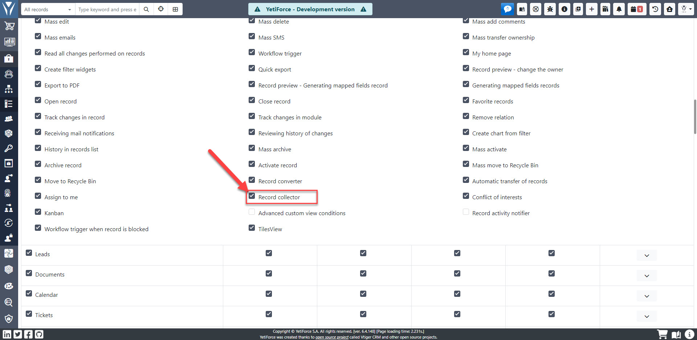

## Prezentacja wideo

import Tabs from '@theme/Tabs';
import TabItem from '@theme/TabItem';
import ReactPlayer from 'react-player';

<Tabs groupId="XlIXiQpC9ug">
    <TabItem value="youtube-XlIXiQpC9ug" label="🎬 YouTube">
        <ReactPlayer
            url="https://www.youtube.com/watch?v=XlIXiQpC9ug"
            width="100%"
            height="500px"
            controls={true}
        />
    </TabItem>
    <TabItem value="yetiforce-XlIXiQpC9ug" label="🎥 YetiForce TV">
        <ReactPlayer url="/video/record-collector.mp4" width="100%" height="500px" controls={true} />
    </TabItem>
</Tabs>

## Uprawnienia

For the collector to work properly you have to check (☑) the "Record collector" field in the profile permission configuration panel (`Software configuration → Permissions → Profiles`) shown below:

If you can't see the "records collector" action in profiles you should edit the following file: modules/Settings/ModuleManager/models/Module.php and add in the variable the following text (only if it's missing)

## Automatyzacja

Kolektory oferujące możliwość autouzupełniania danych mogą być wykorzystywane w akcjach workflow, w celu automatycznej aktualizacji danych, na przykład podczas importu rekordów do systemu.

Wystarczy że ustawimy warunki aby zawsze kolektor rekordów był uruchamiany podczas tworzenia i wybierzemy odpowiednie pola, które mają zostać zaktualizowane, dzięki temu można łatwo zautomatyzować proces importu danych np. leadów.
