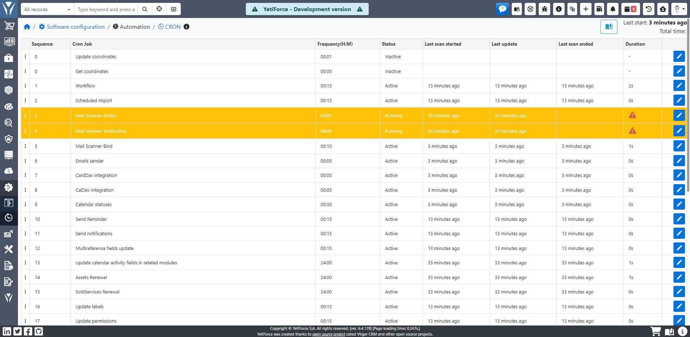

Cron to uniksowy demon zajmujący się okresowym wywoływaniem innych programów. Posługuje się on tabelami crontab do przechowywania informacji jakie zadanie ma uruchamiać. Choć mamy tu na myśli Linuksa, ten sam plik możemy dodać do harmonogramu zadań w Windows. W praktyce, dzięki niemu system YetiForce wykonuje automatyczne różne zadania, które są wywoływane w tle.



## Jak uruchomić cron-a ?

Uruchomienie cron-a sprowadza się do kilku prostych kroków:

### System Linux edycja pliku /etc/crontab , /etc/cron.d/yetiforce lub 'crontab -e':

- Dodanie wpisu do crontab lub pliku cron-a np. w takiej postaci (`__YETIFORCE_PATH__`to pełna bezwzględna ścieżka do folderu z systemem YetiForce np. /var/www/example)

  :::warning
Ważne jest aby skrypt był uruchamiany z takimi samymi uprawnieniami jak właściciel plików CRM-a
:::

```bash
*/2 * * * * www-data __YETIFORCE_PATH__/cron/cron.sh > __YETIFORCE_PATH__/cache/logs/cron.log 2>&1
*/2 * * * * www-data sh /var/www/cron/cron.sh > /var/www/cache/logs/cron.log 2>&1
*/2 * * * * sh __YETIFORCE_PATH__/cron/cron.sh > __YETIFORCE_PATH__/cache/logs/cron.log 2>&1
*/2 * * * * php __YETIFORCE_PATH__/cron.php > __YETIFORCE_PATH__/cache/logs/cron.log 2>&1
*/2 * * * * cd __YETIFORCE_PATH__; /usr/local/bin/php -f cron.php > __YETIFORCE_PATH__/cache/logs/cron.log 2>&1
```

- Zmiana uprawnień pliku `__YETIFORCE_PATH__`/cron/cron.sh na 744 [lub na inne uprawnienia, które są zgodne z wewnętrzną polityka bezpieczeństwa w firmie]


- Ustawienie ścieżki w pliku `__YETIFORCE_PATH__`/cron/cron.sh do PHP: export USE_PHP=/usr/local/php74/bin/php74 [tutaj również trzeba zwrócić szczególną uwagę na plik, ponieważ może on znajdować się na każdym serwerze w innym miejscu a dodatkowo należy zwrócić uwagę na ścieżkę do PHP, która jest różna dla różnych serwerów. Ścieżkę tą może Ci podać administrator serwera lub możesz ją sprawdzić w phpinfo].

  

- Trzeba zwrócić uwagę na znak końca linii, aby był ustawiony Unix (LF), jeśli będzie Windows to często na serwerach linuksowych powoduje to błąd i system nie może uruchomić pliku SH.

  

### System Windows - nie zalecamy korzystania z systemu Windows jako serwera dla aplikacji YetiForce.

### Istnieje możliwość uruchomienia za pomocą adresu URL np. https://gitdeveloper.yetiforce.com/cron.php?app_key=xxxx

Gdzie `app_key` to klucz, który znajduje się w pliku [config/Main.php](https://doc.yetiforce.com/code/classes/Config-Main.html#property_application_unique_key) w zmiennej `$application_unique_key`


### Jeśli jest problem z wywołaniem cron-a z CLI, to jest pewna alternatywa, jednakże nie jest zalecana:

```bash
*/2 * * * * /usr/bin/lynx -source https://gitdeveloper.yetiforce.com/cron.php?app_key=xxxx
*/2 * * * * /usr/bin/wget -O - -q -t 1 https://gitdeveloper.yetiforce.com/cron.php?app_key=xxxx
*/2 * * * * curl -s https://gitdeveloper.yetiforce.com/cron.php?app_key=xxxx
```
