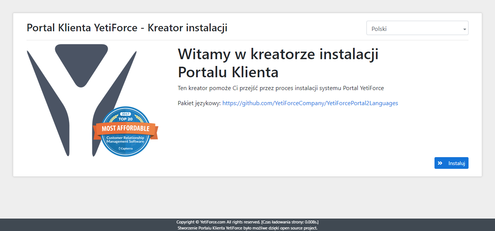

W tym artykule pokażemy jak szybko zainstalować [YetiForce Portal 2](https://github.com/YetiForceCompany/YetiForcePortal2). Portal może służyć jako miejsce przeznaczone dla klienta, dostawcy lub partnera. Jest to uniwersalne narzędzie do komunikacji ze wszystkimi osobami z którymi współpracujemy.

:::tip
**Koniecznie zapoznaj się ze wszystkimi poniższymi informacjami przed przystąpieniem do instalacji systemu.**
:::

import Tabs from '@theme/Tabs';
import TabItem from '@theme/TabItem';
import ReactPlayer from 'react-player';

<Tabs groupId="Language installation and update">
    <TabItem value="youtube" label="🎬 YouTube">
        <ReactPlayer
            url="https://www.youtube.com/watch?v=V-2x00bb4CI"
            width="100%"
            height="500px"
            controls={true}
        />
    </TabItem>
    <TabItem value="yetiforce" label="🎥 YetiForce TV">
        <ReactPlayer url="/video/portal-installation.mp4" width="100%" height="500px" controls={true} />
    </TabItem>
</Tabs>

## Wymagania

Przed rozpoczęciem instalacji sprawdź czy twój serwer jest zgodny z wymaganiami, YetiForce Portal ma takie same jak [YetiForce](/introduction/requirements/)

:::important
Osoba instalująca Portal powinna mieć przynajmniej podstawową wiedzę w zakresie zarządzania serwerem WWW, baz danych, czy też uprawnień na serwerze. 99% problemów instalacyjnych wynika z niewystarczającej wiedzy osób, które instalują aplikację. Jeżeli nie jesteś pewien czy sobie poradzisz, poproś kogoś z odpowiednią wiedzą informatyczną. Cała operacja instalacji zajmie maksymalnie 2 - 10 minut.
:::

Uproszczona instrukcja instalacji znajduje się na [github YetiForcePortal2](https://github.com/YetiForceCompany/YetiForcePortal2#-installation)

## Instalacja YetiForcePortal2

Instalacja Portalu odbywa się tak samo jak inatslacja systemu CRM - za pomocą kreatora przez przeglądarkę.

### Krok 1 - Pobierz i wgraj pliki systemu

W pierwszej kolejności przygotuj pliki instalacyjne. Pobierz YetiForce i najnowszą wersję Portalu z naszych [oficjalnych źródeł](introduction/download).

:::warning
Zalecamy pobranie wersji oznaczonych jako "complete", na przykład `YetiForcePortal2-6.2-complete.zip`. Jeśli została pobrana inna wersja niż "complete", to przed instalacją systemu należy zainstalować biblioteki przy użyciu `yarn` i `composer`.

Ważna jest kolejność - najpierw `yarn`, potem `composer`.

Przykładowy skrypt instalacyjny możesz pobrać [stąd](https://github.com/YetiForceCompany/YetiForceCRM/blob/developer/tests/setup/dependency.sh).
:::

- Pobrany plik ZIP rozpakuj, np. za pomocą programu 7-Zip.
- Katalog z Portalem, który otrzymasz po rozpakowaniu pliku ZIP, skopiuj na serwer WWW, np. za pomocą programu FileZilla, WinSCP.
- Następnie postępuj zgodnie z kreatorem, którego wywołasz z poziomu WWW tam, gdzie skopiowałeś pliki YetiForce Portal.

Lub z konsoli bash:

```bash
cd /home/yfprod/html/
wget -O YetiForcePortal2.zip https://github.com/YetiForceCompany/YetiForcePortal2/releases/download/6.4/YetiForcePortal2-6.4-complete.zip
unzip YetiForcePortal2.zip
rm YetiForcePortal2.zip
chown -R yfprod:yfprod /home/yfprod/html/
```

### Krok 2 - Uruchomienie kreatora instalacji

Uruchom w oknie przeglądarki adres docelowy Twojego Portalu, system powinien pokazać kreator instalacji. Jeśli nie widzisz kreatora, to może oznaczać, że wystąpiły jakieś problemy. Możesz spróbować uruchomić adres: **SITE_URL**/index.php?module=Install&view=Install np. https://gitdevportal.yetiforce.com/index.php?module=Install&view=Install



Na ekranie startowym w kreatorze instalacji dostępna jest możliwość konfiguracji języka instalacji.

### Krok 3 - Wprowadzanie danych dostępowych

:::warning
**Ten krok wymaga aktywnego dostępu do API!!!**

W razie problemów zapoznaj się z dokumentacją oraz informacjami na [github](https://github.com/YetiForceCompany/YetiForcePortal2#-installation)

Dane dostępowe można znaleźć w panelu [`Konfiguracja systemu → Integracja → Web service - Aplikacje`](/administrator-guides/integration/webservice-apps/) w CRM.
:::
