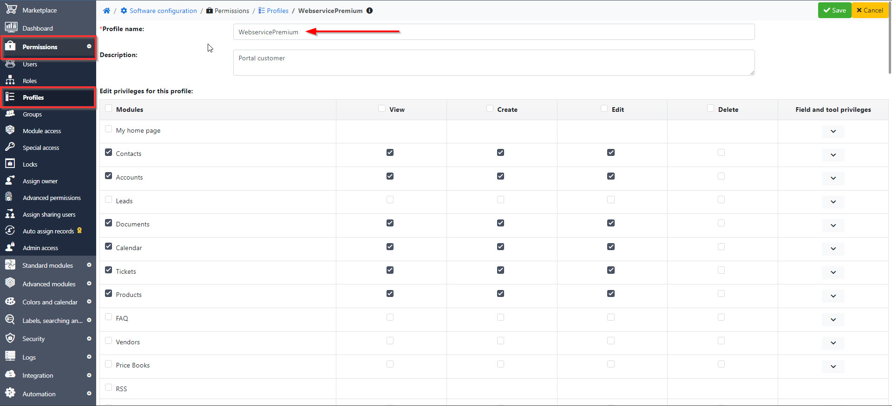
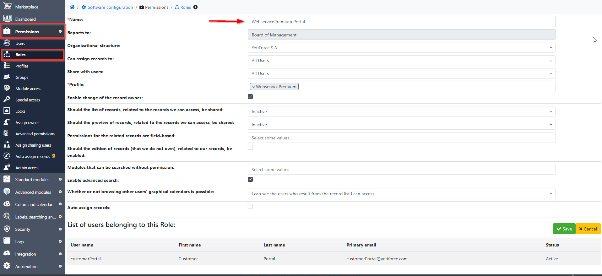
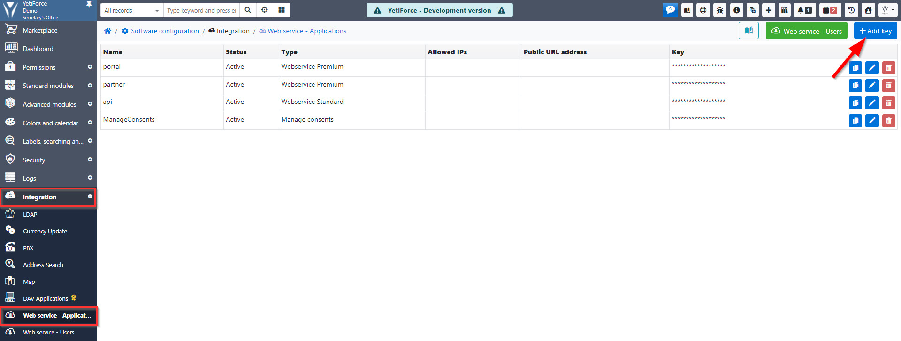
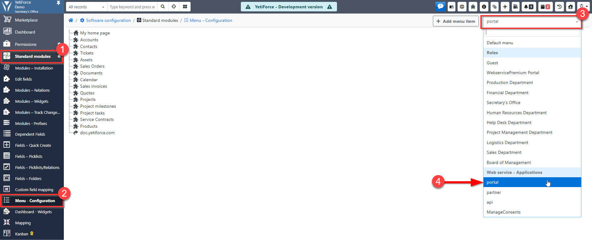
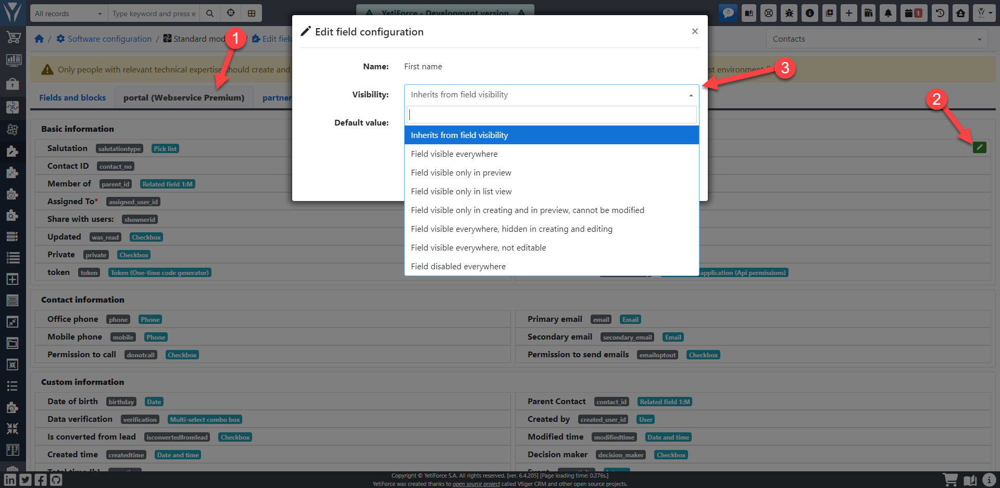
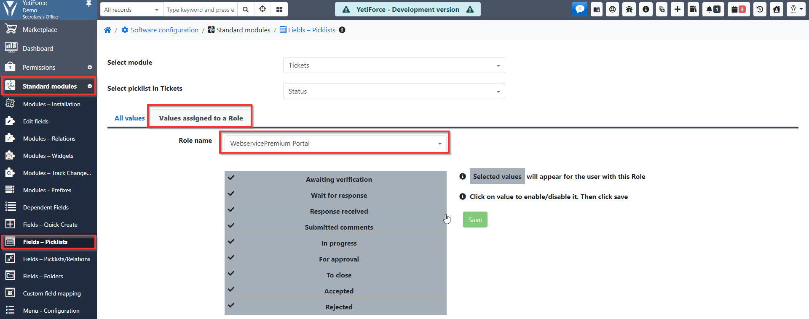

One of the elements of the portal installation is to configure the system so that the portal is ready for use. The tutorial shows how to properly configure your system.

## Profile

Create a new profile that will specify what permissions are granted to the portal users. Profile management can be found in [`Software configuration → Permissions → Profiles`](/administrator-guides/permissions/profiles/).

## Roles

The profile must be assigned a new role. To do that, go to [`Software configuration → Permissions → Roles`](/administrator-guides/permissions/roles/) and create a new role using the profile you created earlier.

## Users

Create a new user with the role you created in the previous step. In order to do that go to [`Software configuration → Permissions → Users`](/administrator-guides/permissions/users/). The user will be needed to define permissions and will be the default owner for newly created records.

## Web service - Aplikacje

The next step is adding an application for API in [`Software configuration → Integration → Web service - Applications`](/administrator-guides/integration/webservice-apps/). The application type should be set to `Webservice Premium`. It will allow you to use an API container called Webservice Premium. A complete documentation can be found at https://doc.yetiforce.com/api

:::warning
`Webservice Premium API` is a paid feature, it requires purchasing [YetiForce Webservice Premium](https://yetiforce.com/en/yetiforce-webservice-premium)
:::

## Menu

Another element critical for the portal to work properly is the menu. You can find the configuration panel for the menu in [`Software configuration → Standard modules → Menu - Configuration`](/administrator-guides/standard-modules/menu/).

Thanks to creating a separate menu accessible exclusively to portal you can limit the number of modules available to portal users.

:::warning
For the modules to be visible, you have to grant permissions in profiles, otherwise the modules won't show up in the menu.
:::

## Record access fields

:::warning
This step is only required for webservice users whose type is different than `permissions based on user`.
:::

When API users are assigned to contacts, it's required to add a field that will allow you to control access to records. Records won't be available in the portal unless this field is configured.

This solution allows you to have several portals/webservice apps and control record availability for them separately.

:::info
Each module that should be available in the portal must contain this field.
:::

### Field configuration can be found in [`Software configuration → Standard modules → Edit fields`](/administrator-guides/standard-modules/edit-fields/).

### Manage record access in portal

## Visibility and enforcing default values only for portal/API

Enabling this option will cause all records created from portal/API to have the same value set by default.

Portal field management can be found in [`Software configuration → Standard modules → Edit fields`](/administrator-guides/standard-modules/edit-fields/)

## Permissions for picklist values

Available values should also be specified for picklists based on roles. Without this setting, the user won't see the selection list for picklists based on roles when creating or editing records.

The panel can be found in [`Software configuration → Standard modules → Fields – Picklists`](/administrator-guides/standard-modules/fields-picklists/)

## Web service - Users

:::warning
For webservice users whose type is different than `permissions based on user` an Account and Contact should be created in advance.
:::

The last step is to add portal users, which can be done in [`System configuration > Integration > Web service - Users`](/administrator-guides/integration/webservice-users/).

The password can only be set from the system while creating a user, the portal only offers an option to change or reset the password.

